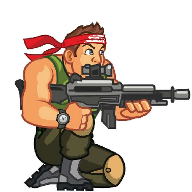

# Dragon Fighter

This is a mobile web game made in web frameworks.

## Installation

### For Andriod
1) Download the application - [download]("dragon.apk")
2) Go to downloads (in your browser), click on install

### For other devices
1) Download this source code

## Execution

### For andriod
1) Follow the installation guide
2) Open the "dragon fighter", which is installed in your phone and enjoy!!

### For other devices
 Download the game, and open "index.html" file in your web browser & enjoy the game.

## Demo
link to demo - [site](https://github.com/abhineetraj1/dragon-fighter)

## Languages used:-

     

## Authors
- [@abhineetraj1](https://www.github.com/abhineetraj1)
